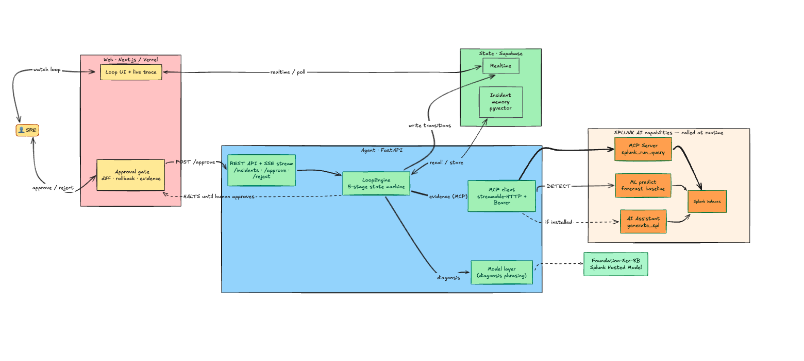
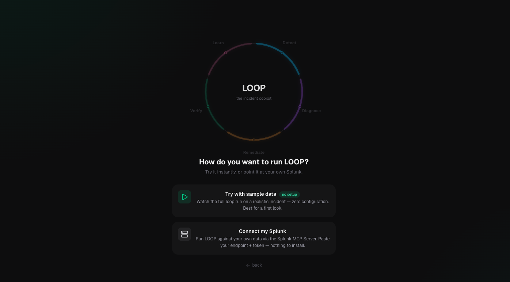

# LOOP

**A human-in-the-loop incident-resolution copilot for SREs.**

> Splunk's agent tells you what broke. **LOOP gives you the fix, ready to approve
> in one click** — proves it worked against live data, and remembers the pattern
> so the next one is one click away. **Human stays in command.**

LOOP was built for the Splunk Agentic Ops Hackathon. **Track: Observability**
(also targeting Best Use of Splunk MCP Server and Best Use of Splunk Hosted
Models). LOOP is a new project created during the Hackathon Submission Period.

## Architecture at a glance

The lanes answer the three required hooks: **how the app talks to Splunk**,
**how Splunk AI is integrated**, and **the data flow between services**.



**Legend** — 🟠 orange = **Splunk AI** (MCP Server, ML `predict`, AI Assistant:
the prize surfaces) · 🔵 blue = **the agent** · 🟢 green = state / hosted model ·
🟡 yellow = **human touchpoints** (the SRE and the approval gate). Bold arrows are
the live Splunk evidence path; the gate **halts until a human approves**. Full
stage-by-stage version: [`architecture_diagram.md`](./architecture_diagram.md).

---

> ### 🧑‍⚖️ For judges — zero setup
> You do **not** need Splunk to evaluate LOOP:
> 1. Open the live app and complete the 20-second onboarding.
> 2. Choose **“Try with sample data (no setup)”** → click **Run the live demo**.
>    You'll see the full loop (detect → diagnose → ✋ approve → verify → learn)
>    run on a realistic incident with **zero configuration**.
> 3. To use real data, pick **“Connect my Splunk”** in onboarding and paste your
>    Splunk MCP Server endpoint + encrypted token — nothing to install.
>
> The demo video shows LOOP running against a **real Splunk instance**.



---

## What LOOP does 

Think of **Splunk as a smoke detector**: it stores every signal your systems
emit and screams "there's smoke!" when something's wrong. **LOOP is the
assistant who runs in**, finds the source, hands you the extinguisher, waits for
your go-ahead, puts the fire out, and remembers the spot so next time is instant.

Here's a real run — a checkout service slowing down — and what LOOP does at each
step, every fact pulled live from Splunk:

1. **Detect** — Checkout's response time jumps from **~280 ms to ~3.2 s**. LOOP
   spots the spike in Splunk and pins the minute it started.
2. **Diagnose** — LOOP tests theories against real data: payments? database
   pool? traffic? All healthy (red herrings). Then the key move — it checks the
   **deployment log** and finds **a code deploy (v2.4.1) went out one minute
   before the spike**, introducing a slow "N+1" database query. *(This is the
   cross-domain insight: connecting a performance problem to the deploy that
   caused it.)*
3. **Remediate** — LOOP drafts the exact fix: roll back v2.4.1 **and** a code
   patch for the bug — but applies **nothing**.
4. **✋ Approve** — It shows you the fix with the evidence and **waits**. *You*
   click Approve. LOOP never acts on its own.
5. **Verify** — After you approve, it queries Splunk **again** to prove the
   response time dropped back to ~280 ms. Proof, not a guess.
6. **Learn** — It remembers this pattern. When the same kind of bug later hits a
   different service, LOOP recognizes it instantly and offers the fix in **one
   click**.

That's the whole product: **Splunk holds the story of the outage; LOOP reads it,
finds the cause, proposes the fix, you approve, it proves the fix worked, and it
remembers.**

---

## The design principle, stated up front: LOOP proposes, the human approves

LOOP **never executes a fix autonomously.** It does all the work — detect,
diagnose, draft the *exact* remediation (a rollback **and** a code-level diff) —
then presents it with evidence and **halts at a human approval gate.** Nothing
is applied until an engineer clicks **Approve & Resolve**.


LOOP is a **copilot, not an autopilot**: it makes the next move obvious and one
click away, and keeps the engineer in command of every action.

## The loop Splunk leaves open — and LOOP closes

Splunk's AI Troubleshooting Agent does **detect + diagnose**, then hands a human
a remediation to-do list. LOOP closes the loop:

```
DETECT → DIAGNOSE → REMEDIATE (propose) → ✋ HUMAN APPROVES → VERIFY → LEARN
```

Three things differentiate LOOP — and no shipping Splunk feature does all three:

- **Cross-domain correlation (headline feature).** LOOP connects the
  observability anomaly (latency) to the **CI/CD deployment event** that caused
  it — two domains Splunk uniquely sees together. The diagnosis explicitly links
  the latency spike to deploy `v2.4.1` and the N+1 query it introduced.
- **Verify.** After the human approves, LOOP re-queries Splunk on the post-fix
  window and **proves on live data** that p95 returned to baseline. Closure is
  evidence-backed, not a status flip.
- **Learn.** LOOP stores each resolved incident's *signature* (pgvector). When a
  similar pattern recurs, it recognizes it instantly and pre-fills the known fix
  for **one-click approval** — collapsing time-to-resolution while keeping the
  human gate.

## How it works

- **`web/`** — Next.js (App Router, TypeScript, Tailwind) on Vercel. Renders the
  loop as a closing ring, a centerpiece **approval gate**, a live reasoning
  trace, the cross-domain banner, a before/after p95 sparkline, and an MTTR +
  memory shelf. Uses Supabase realtime (falls back to polling the agent).
- **`agent/`** — Python FastAPI service: the 5-stage loop state machine, the
  Splunk MCP client, a swappable hosted-model layer, and the incident-memory
  store. Streams steps via SSE and writes state to Supabase.
- **Supabase** — Postgres + realtime + **pgvector** for incident-signature memory.
- **Splunk MCP Server** — the real data source. Every stage's evidence comes
  from real `splunk_run_query` calls (against `index=ecommerce` for the demo, or
  any index/sourcetype you choose in generic mode).
- **Foundation-Sec-8B** (Splunk Hosted Model) — an *optional* swappable model
  behind the diagnosis/remediation interface (set `HOSTED_MODEL_*` to enable).

See [`architecture_diagram.md`](./architecture_diagram.md) for the full diagram
(the human approval gate is marked explicitly in the flow).

## Splunk AI capabilities used at runtime

LOOP invokes Splunk's own AI/ML on **every run** — not a mock, not a planned
integration:

1. **Splunk MCP Server** — the agent is an MCP client (`agent/mcp_client.py`) and
   every loop stage's evidence comes from real `splunk_run_query` calls (DETECT
   timechart, deploy correlation, VERIFY re-query).
2. **Splunk ML (`predict`)** — DETECT runs Splunk's built-in `predict` ML command
   to forecast the metric's expected baseline and quantify the regression
   (`agent/loop.py`, marked **Splunk AI** in the live trace). This is **core
   Splunk** — no extra app required.
3. **Splunk AI Assistant for SPL** — when the AI Assistant app is installed, the
   agent calls **`generate_spl`** (natural-language → SPL) in DETECT and
   **`ask_splunk_question`** in DIAGNOSE, via MCP. Gracefully skipped if absent.

Each Splunk-AI step is visibly tagged **“Splunk AI”** in the reasoning trace so
it's obvious in the demo. *(Recommended for the AI Assistant path: install
[Splunk AI Assistant for SPL](https://splunkbase.splunk.com/app/7245).)*

---

## Run it locally

There are two ways to run LOOP. **Path A** gets the full UI + closing loop
working in ~2 minutes with **zero external services** (stub mode). **Path B**
swaps in real Splunk data. Do Path A first — it proves the app works — then
layer on Path B.

> **Ports:** the web runs on **3000**, the agent on **8001**. (Splunk
> Enterprise's own web UI uses 8000, so the agent deliberately avoids it.)

### Prerequisites
- **Python 3.11–3.12** and **Node 18+**.
- For Path B only: a local Splunk Enterprise (or Splunk Cloud) instance.
- Supabase and a hosted model are **optional** — without them the agent uses an
  in-memory store and a deterministic diagnosis fallback.

---

### Path A — run locally in stub mode (no Splunk, no Supabase)

**1. Start the agent** (terminal 1):
```bash
cd agent
python -m venv .venv && source .venv/bin/activate
pip install -r requirements.txt
LOOP_ALLOW_STUBS=1 uvicorn main:app --port 8001
```
Sanity check in another shell: `curl localhost:8001/` →
`{"service":"loop-agent","status":"ok", ...}`.

**2. Start the web** (terminal 2):
```bash
cd web
npm install
cp .env.local.example .env.local      # already points at http://localhost:8001
npm run dev
```
Open http://localhost:3000 and click **Run full demo**. The loop runs
Detect → Diagnose → ✋ approval gate → Verify → Learn on deterministic data
matching the seeded incidents. This is exactly what a judge sees with no setup.

> Stub mode = the agent fabricates Splunk rows that match the demo incidents,
> uses an in-memory store, and a deterministic diagnosis. The full UX works; the
> data just isn't from a live Splunk.

---

### Path B — wire it to real Splunk

Full screenshots-level walkthrough: **[`SPLUNK_SETUP.md`](./SPLUNK_SETUP.md)**.
The short version:

**1. Install the MCP Server app.** In Splunk (http://localhost:8000) →
**Apps → Find More Apps** → install **Splunk MCP Server** (Splunkbase 7931).
Open the app → **Create MCP Encrypted Token** → copy it. The app also shows the
endpoint (`https://localhost:8089/services/mcp`).

**2. Create the index + an HEC token.**
- **Settings → Indexes → New Index** → name `ecommerce`.
- **Settings → Data Inputs → HTTP Event Collector** → enable globally →
  **New Token** named `loop` with **Allowed Indexes = `ecommerce`** → copy it.

**3. Configure `agent/.env`:**
```
SPLUNK_MCP_URL=https://localhost:8089/services/mcp
SPLUNK_MCP_TOKEN=<the encrypted MCP token from step 1>
SPLUNK_VERIFY_TLS=0          # local Splunk uses a self-signed cert
SPLUNK_HEC_TOKEN=<the HEC token from step 2>
LOOP_ALLOW_STUBS=0
```

**4. Load the demo data and verify the connection:**
```bash
cd agent && source .venv/bin/activate
python -m seed.load_seed     # posts ~1900 events into index=ecommerce via HEC
python smoke_mcp.py          # lists MCP tools + runs live SPL; expect [LIVE] rows
```

**5. Run it** (same as Path A but `LOOP_ALLOW_STUBS=0`):
```bash
uvicorn main:app --port 8001       # terminal 1
cd ../web && npm run dev           # terminal 2
```
Now every stage's evidence comes from real `run_splunk_query` calls against
your `index=ecommerce`. On startup the agent logs the MCP tools it discovered
(and whether `generate_spl`/`explain_spl` are available).

---

### Optional — Supabase realtime + persisted memory

Without Supabase the agent uses an in-memory store (fine for the demo). To
enable realtime + the pgvector incident memory:
1. In the Supabase SQL editor, run [`agent/db/schema.sql`](./agent/db/schema.sql)
   (creates the tables, the `match_incident_memory` RPC, realtime, demo RLS).
2. Add `SUPABASE_URL` / `SUPABASE_ANON_KEY` / `SUPABASE_SERVICE_KEY` to
   `agent/.env`, and `NEXT_PUBLIC_SUPABASE_URL` / `NEXT_PUBLIC_SUPABASE_ANON_KEY`
   to `web/.env.local`.

### The demo
Click **Run full demo** to fire Incident 1 (checkout) then Incident 2 (wishlist
recurrence) end-to-end, or trigger each with the preset buttons. Full narration:
[`DEMO_SCRIPT.md`](./DEMO_SCRIPT.md).

---

## Use it on your own data (generic mode)

LOOP isn't limited to the seeded incident. Connect your own Splunk and point it
at any service — it **discovers your data so you don't guess field names**.

1. **Connect** — onboarding (or the connection pill) → **Connect my Splunk** →
   paste your MCP endpoint + encrypted token. The agent verifies via the MCP
   Server (lists tools + a test query).
2. **Analyze** — the toolbar **Analyze** button opens a form that auto-populates
   from your Splunk:
   - **Index** ← `GET /splunk/indexes`
   - **Sourcetype** ← `GET /splunk/sourcetypes?index=…`
   - **Latency field** ← `GET /splunk/fields…` (samples events, lists numeric
     fields, and **auto-suggests** the latency-like one)
   - plus optional **service**, **deploy sourcetype**, and a **time range**.
3. LOOP runs the full loop on your data: detect the p95 anomaly → **correlate it
   to your deployment events** (cross-domain) → propose a fix → ✋ approval gate →
   verify → learn.

**Honest scope:** generic mode targets the common **"latency regression ↔
deploy"** pattern. It expects a numeric latency-style field; if it finds an N+1
it proposes the exact code fix, if it only finds a correlated deploy it proposes
a **rollback-first** remediation (no fabricated diff), and if no deploy
correlates it says so and recommends reviewing recent changes. The curated
checkout/wishlist incident remains the fully-closed exemplar.

> ⚠️ **Reachability:** discovery + analysis require the agent to reach that
> Splunk over the network. Running locally (agent + Splunk on one machine) works.
> For a **deployed** agent, a judge's `localhost` Splunk is not reachable — use
> **sample mode** for the hosted demo, or connect a publicly reachable Splunk
> Cloud stack.

---

## Environment variables

### Agent (`agent/.env`)
| Var | Purpose | Needed when |
|---|---|---|
| `SPLUNK_MCP_URL` | Streamable-HTTP MCP endpoint, e.g. `https://localhost:8089/services/mcp` | real Splunk |
| `SPLUNK_MCP_TOKEN` | Encrypted token from the Splunk MCP Server app | real Splunk |
| `SPLUNK_VERIFY_TLS` | `0` to skip TLS verify for local self-signed Splunk; `1` for Cloud | real Splunk (local) |
| `SPLUNK_HEC_URL` | HEC endpoint (default `https://localhost:8088/services/collector/event`) | seed loader |
| `SPLUNK_HEC_TOKEN` | HEC token allowing index `ecommerce` | seed loader |
| `HOSTED_MODEL_URL` | OpenAI-compatible base URL for the hosted model | optional |
| `HOSTED_MODEL_KEY` | Hosted-model API key | optional |
| `HOSTED_MODEL_NAME` | Model name (default `foundation-sec-8b`) | optional |
| `ANTHROPIC_API_KEY` | Orchestrator fallback if the hosted model is unreachable | optional |
| `SUPABASE_URL` / `SUPABASE_ANON_KEY` / `SUPABASE_SERVICE_KEY` | Supabase project + keys | optional (realtime) |
| `LOOP_CORS_ORIGINS` | Comma-separated allowed origins (Vercel domain + localhost) | deploy |
| `LOOP_ALLOW_STUBS` | `1` = stubbed Splunk/model/store for local dev; `0` = require live creds | always |

### Web (`web/.env.local`)
| Var | Purpose |
|---|---|
| `NEXT_PUBLIC_AGENT_URL` | Base URL of the LOOP agent |
| `NEXT_PUBLIC_SUPABASE_URL` | Supabase URL — when set, the UI uses realtime |
| `NEXT_PUBLIC_SUPABASE_ANON_KEY` | Supabase anon key |

All secrets are read from env; nothing is hardcoded.

## Deploy
- **Agent** — `agent/render.yaml` (Render) or `agent/Procfile` (Railway/Heroku).
  Set the env vars in the dashboard and `LOOP_ALLOW_STUBS=0`.
- **Web** — deploy `web/` to Vercel; set the `NEXT_PUBLIC_*` env vars.

## The seeded incidents
- **Incident 1 (teacher):** checkout p95 ~280ms → deploy `v2.4.1` at 14:19
  introduces an N+1 on `cart_items` → p95 ~3200ms (14:20–14:45) → rollback to
  `v2.4.0` at 14:46 → recovery. True cause = the deploy. Payment, pool, and
  volume stay healthy (red herrings).
- **Incident 2 (recurrence):** wishlist service, deploy `v1.7.0` at 16:49, same
  N+1 anti-pattern on `wishlist_items`. LOOP recognizes Incident 1's signature.

## Submission checklist (Splunk Agentic Ops Hackathon)
- [x] **Uses Splunk AI at runtime** — MCP Server (`splunk_run_query`), Splunk ML
  (`predict`), and AI Assistant (`generate_spl` / `ask_splunk_question`) are
  called on every run (see "Splunk AI capabilities used at runtime"). Not a mock.
- [x] **Architecture diagram** — [`architecture_diagram.md`](./architecture_diagram.md)
  at repo root (shows Splunk interaction, AI integration, data flow).
- [x] **New / substantially updated in-period** — created during the Submission
  Period; commit history reflects it.
- [x] **OSI license** — MIT [`LICENSE`](./LICENSE) at root (shows in GitHub About).
- [ ] **Public repo** — confirm the repo is public (open the link in an incognito
  window) and **push the latest commits** before submitting.
- [ ] **Track selected** — Observability.
- [ ] **< 3-min demo video** — show it running against real Splunk (the "Splunk
  AI" trace tags make the Splunk-AI usage obvious).

## License
MIT — see [`LICENSE`](./LICENSE).
